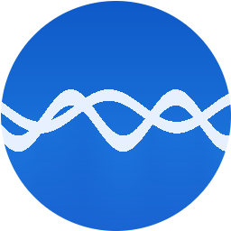

# Clean Surf 🏄

A privacy-first macOS browser built on Chromium. Blocks ads and trackers, auto-dismisses cookie banners and sign-in popups, and spoofs browser fingerprints — all out of the box.



---

## Features

| Feature | Details |
|---|---|
| **Ad & tracker blocking** | Blocks thousands of trackers per page using Ghostery's filter lists. Live count shown in the toolbar. |
| **Cookie banner dismissal** | Auto-clicks "Reject All" on OneTrust, Cookiebot, TrustArc, Didomi, and 20+ other CMPs. |
| **Sign-in popup blocking** | Closes Booking.com "Genius", hotel membership gates, and similar modal overlays automatically. |
| **Paywall overlay removal** | Dismisses subscribe/paywall modals on news sites. |
| **Fingerprint spoofing** | Adds per-session noise to canvas reads and spoofs WebGL renderer/vendor strings. |
| **Notification blocking** | Auto-denies all `Notification.requestPermission()` calls at the session level. |
| **No Electron in user-agent** | Reports as standard Chrome — prevents bot detection by Google reCAPTCHA and others. |
| **Bookmark bar** | Star button (⌘D), persistent bookmarks bar (⌘⇧B to toggle), right-click to remove. |
| **History** | Full browsing history at ⌘Y with search and clear. Not recorded in private mode. |
| **Private window** | ⌘⇧N opens an isolated session with stricter fingerprint noise and no history. |
| **Chrome shortcuts** | ⌘T, ⌘W, ⌘L, ⌘D, ⌘Y, ⌘[, ⌘], ⌘R, ⌘⇧T, ⌘1–9, ⌘⇧B |
| **Extension support** | Chrome Web Store extensions (MV3) via drag-and-drop `.crx` install. |

---

## Requirements

- macOS 12 Monterey or later
- Apple Silicon Mac (M1, M2, M3, or later)

> Intel Mac builds are not currently provided. See [Development](#development) to build from source on Intel.

---

## Install

### Option A — Download (recommended)

1. Go to [Releases](https://github.com/harpar-ai/clean-surf/releases/latest)
2. Download `Clean Surf-x.x.x-arm64.dmg`
3. Open the DMG and drag **Clean Surf** to your Applications folder
4. macOS will block it the first time — **two ways to open it:**

   **Option 1 (fastest):**
   - Double-click Clean Surf → click "Show in Finder" in the dialog
   - Right-click Clean Surf in Finder → click **Open**
   - Click **Open** in the confirmation dialog

   **Option 2 (System Settings):**
   - Double-click Clean Surf → click OK
   - Open **System Settings → Privacy & Security**
   - Scroll down to find "Clean Surf was blocked" → click **Open Anyway**

5. After opening once, Clean Surf launches normally every time.

> **Why the warning?** Clean Surf is not notarized with Apple ($99/year developer program). This is a standard macOS warning for apps distributed outside the App Store. The source code is fully public at this repo.

### Option B — Build from source

See [Development](#development) below.

---

## Updates

Clean Surf checks for updates automatically every 6 hours. When a new version is available you'll get a macOS notification — click it to open the release page and download.

You can also check manually: **Clean Surf → Check for Updates…**

---

## Development

### Prerequisites

- Node.js 18+
- npm 9+
- macOS (required — this is a macOS-only app)

### Setup

```bash
git clone https://github.com/harpar-ai/clean-surf.git
cd clean-surf
npm install        # installs deps + patches Electron bundle name + installs pre-commit hook
npm run build      # compiles TypeScript → out/
```

### Run in development

```bash
./node_modules/.bin/electron out/main/index.js
```

### Run tests

```bash
npm test           # launches the app and runs 66 browser + security tests
```

### Package as DMG

```bash
npm run package    # outputs dist/Clean Surf-x.x.x-arm64.dmg
```

### Check for secrets before committing

A pre-commit hook runs automatically on every `git commit`. To run manually:

```bash
npm run check-secrets
```

Scans all tracked files for email addresses, API keys, private keys, AWS credentials, GitHub tokens, hardcoded passwords, and local machine paths.

---

## Project structure

```
src/
  main/           # Electron main process (Node.js)
    index.ts        # App entry, menu, protocol handler
    tab-manager.ts  # WebContentsView per tab, navigation, history tracking
    session-manager.ts  # Normal vs private sessions, permission handlers
    ad-blocker.ts   # Ghostery adblocker integration
    bookmark-manager.ts / history-manager.ts
    extension-manager.ts  # Chrome extension support
    update-checker.ts     # GitHub Releases update check
  preload/
    browser-preload.ts  # contextBridge API exposed to the toolbar UI
    page-preload.ts     # Injected into every web page: fingerprint spoofing,
                        # notification blocking, cookie banner dismissal
  renderer/       # Browser toolbar UI (React + TypeScript)
    App.tsx         # Tab bar, address bar, bookmark bar, privacy badge
    components/
scripts/
  check-secrets.js   # Secret/personal-info scanner (pre-commit + pre-package)
  setup-hooks.js     # Installs git pre-commit hook
tests/
  browser.test.mjs   # 66 end-to-end tests (Playwright + Electron)
assets/
  CleanSurf.icns     # App icon
```

---

## Architecture notes

- **Window model**: `BaseWindow` + `WebContentsView` (Electron 35+). The toolbar UI is one `WebContentsView`; each browser tab is a separate `WebContentsView` stacked beneath it.
- **Ad blocking**: [`@ghostery/adblocker-electron`](https://github.com/ghostery/adblocker) with prebuilt EasyList + EasyPrivacy filter lists.
- **Extension support**: [`electron-chrome-extensions`](https://github.com/samuelmaddock/electron-chrome-extensions) with GPL-3.0 license.
- **Fingerprint spoofing**: Injected via `<script>` into every page's main world from the preload's isolated context.
- **Internal pages**: `cleanshell://history` served by a custom Electron protocol handler.

---

## Privacy model

Clean Surf is designed for personal use. It does **not**:
- Send telemetry or analytics anywhere
- Sync data to any server
- Require an account

All data (history, bookmarks) is stored locally in `~/Library/Application Support/Electron/`.

---

## Security

Clean Surf has been reviewed for common Electron security issues:

- `contextIsolation: true`, `nodeIntegration: false` on all web-facing content
- IPC handlers validate type and length of all user-supplied inputs
- No `allowFileAccess` on loaded extensions
- Extension installation removed from web-accessible IPC (menu only)
- HTML-escaped user data in all internal pages
- No shell injection in extension installer (`execFileSync` with array args)
- Favicon validation blocks SVG XSS vectors
- Pre-commit hook blocks secrets from entering the repo

To report a security issue, open a [GitHub issue](https://github.com/harpar-ai/clean-surf/issues).

---

## License

GPL-3.0 — see [LICENSE](LICENSE).

This project uses [electron-chrome-extensions](https://github.com/samuelmaddock/electron-chrome-extensions) (GPL-3.0), which requires the combined work to also be GPL-3.0. Source code is available in this repository.

**Third-party components:**
- [Electron](https://www.electronjs.org/) — MIT
- [Chromium](https://www.chromium.org/) — BSD-3-Clause
- [@ghostery/adblocker-electron](https://github.com/ghostery/adblocker) — MPL-2.0
- [electron-chrome-extensions](https://github.com/samuelmaddock/electron-chrome-extensions) — GPL-3.0
- [React](https://react.dev/) — MIT

---

> Clean Surf is an independent project and is not affiliated with, endorsed by, or connected to Google LLC, the Chromium project, or the Chrome browser. "Chrome" and "Chromium" are trademarks of Google LLC.
